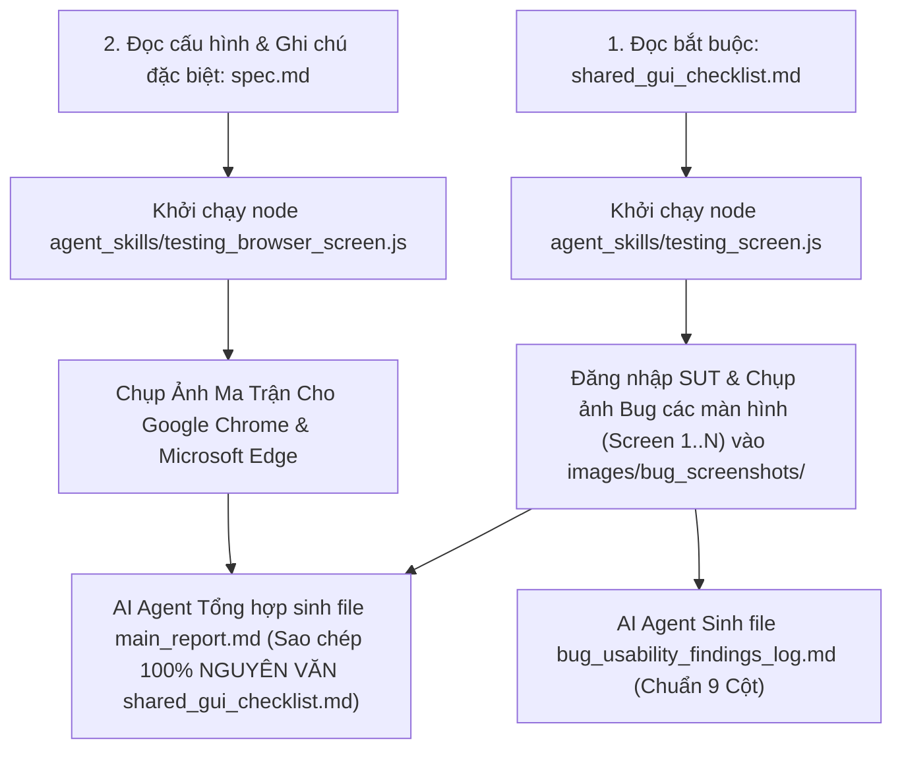

# Agent Skill Specification: GUI & Usability Testing Master Standard (gui_testing.md)

> **Mã Skill / Standard Identifier:** `gui_testing.md`  
> **Chức năng:** Hướng dẫn quy trình Orchestration chuẩn cho AI Agent thực hiện tự động hóa toàn bộ quá trình kiểm thử GUI, Usability, và Cross-Browser/Cross-Platform bằng **Automation Scripts** ([testing_screen.js](/agent_skills/testing_screen.js) & [testing_browser_screen.js](/agent_skills/testing_browser_screen.js)), đảm bảo định dạng đầu ra **THEO BÁO CÁO MẪU CHUẨN**.

---

## 1. ĐẦU VÀO CỦA AGENT (INPUT SPECIFICATION)

1. **File Checklist Chuẩn Nhóm Bắt Buộc (`shared_gui_checklist.md`):**
   - **Đường dẫn tệp:** [shared_gui_checklist.md](/shared_gui_checklist.md)
   - Chứa > 40 tiêu chí được phân loại theo 4 khía cạnh: `IA-01` (General UI), `IA-02` (Forms), `IA-03` (Navigation), `IA-04` (Feedback & State).
   - Ánh xạ trực tiếp tới Nielsen 10 Heuristics, Norman 6 Principles, và Shneiderman 8 Golden Rules.

2. **File Cấu Hình & Ghi Chú Đặc Biệt từ User (`spec.md`):**
   - **Đường dẫn tệp:** [agent_skills/spec.md](/agent_skills/spec.md)
   - Chứa URL hệ thống SUT, thông tin tài khoản đăng nhập, đặc tả Scenario, danh sách Màn hình linh hoạt (`Screen 1`, `Screen 2`, `Screen 3`... `Screen N`) và **Mục 3: Ghi chú đặc biệt & Điều cần lưu ý cho AI Agent**.

3. **Mã Nguồn Automation Scripts (Chrome & Edge Native):**
   - [agent_skills/testing_screen.js](/agent_skills/testing_screen.js): Tự động đọc cấu hình màn hình từ `spec.md`, thực thi kiểm thử và chụp ảnh bug vào `images/bug_screenshots/`.
   - [agent_skills/testing_browser_screen.js](/agent_skills/testing_browser_screen.js): Tự động chụp ma trận thực tế trên 2 trình duyệt **Google Chrome** và **Microsoft Edge** có chèn Watermark MSSV vào `images/cross_platform_screenshots/`. Các môi trường còn lại (Firefox, Opera, Safari, Mobile) được tạo dòng khung trong ma trận với trạng thái `N/A`.

---

## 2. QUY TẮC RÀ SOÁT VÀ SAO CHÉP CHECKLIST CHÍNH XÁC 100% (STRICT CHECKLIST REPLICATION RULE)

Toàn bộ các AI Agent khi thực thi skill này **BẮT BUỘC PHẢI THUÂN THỦ NGHIÊM NGẠT** quy tắc sau để đảm bảo tính đồng bộ dữ liệu:

1. **BƯỚC ĐỌC BẮT BUỘC:** AI Agent phải dùng lệnh `view_file` đọc trực tiếp tệp [shared_gui_checklist.md](/shared_gui_checklist.md) và [agent_skills/spec.md](/agent_skills/spec.md) trước khi sinh bất kỳ bảng báo cáo nào.
2. **ĐỌC & XỬ LÝ GHI CHÚ ĐẶC BIỆT THUỘC MỤC 3 CỦA SPEC.MD:**
   - AI Agent phải kiểm tra kỹ **Mục 3 (Ghi chú đặc biệt & Điều cần lưu ý)** trong `spec.md` để nắm các lưu ý bố cục hoặc thao tác đặc thù (ví dụ: hai màn hình dùng chung 1 URL nhưng phân tách theo vị trí cuộn trang, hoặc các nút cần quyền phê duyệt).
3. **CAM KẾT SAO CHÉP NGUYÊN VĂN (VERBATIM COPY):**
   - Khi tạo **Phần 1A (Shared Checklist)** và **Phần 1B (Executed Checklist per Screen)** trong `main_report.md`, AI Agent **KHÔNG ĐƯỢC PHÉP** tóm tắt, tự viết lại, bỏ bớt dòng hay sửa đổi bất kỳ ký tự nào trong cột `Mục Kiểm Tra (Checklist Item Description)` và `Ánh Xạ Heuristics`.
   - **Đảm bảo đầy đủ 100% tiêu chí:** Bắt buộc sao chép trọn vẹn toàn bộ các mục từ `IA-01-01` đến `IA-04-14` (đủ 49 tiêu chí) từ `shared_gui_checklist.md` sang các bảng tương ứng.
4. **ÁNH XẠ LINK BUG CHUẨN:**
   - Tại Phần 1B, ở các ô đánh giá `Fail`, cột Ghi chú bắt buộc chèn Markdown link dẫn tới mã Bug tương ứng trong `bug_usability_findings_log.md` (ví dụ `[BUG-Screen1-01](/bug_usability_findings_log.md)`) và đường dẫn ảnh bug `[Xem ảnh](images/bug_screenshots/...)`.

---

## 3. THỰC THI THỰC ĐỊA & ĐIỀU PHỐI CỦA AGENT (ORCHESTRATION WORKFLOW)



---

## 4. ĐẦU RA YÊU CẦU DỰ ÁN & FORMAT MẪU CHUẨN TRÍCH DẪN (OUTPUT SPECIFICATION)

Agent có trách nhiệm sinh và duy trì 2 file báo cáo cốt lõi với định dạng **KHỚP 100%** với mẫu chung bên dưới:

---

### FILE 1: `main_report.md` (Báo Cáo Tổng Hợp Kiểm Thử GUI & Usability)

#### Header & Thông Tin Sinh Viên Mẫu Tổng Quát
```markdown
# BÁO CÁO KIỂM THỬ GIAO DIỆN VÀ KHẢ NĂNG SỬ DỤNG (GUI & USABILITY REPORT)

- **Họ và tên sinh viên:** NGUYỄN VĂN A
- **Mã số sinh viên (MSSV):** 12345678
- **Mã nhóm (Group ID):** NHÓM 01
- **Tên kịch bản Scenario:** Scenario Name — [Mô tả kịch bản kiểm thử do người dùng nhập trong spec.md]
```

---

#### PHẦN 1: BÁO CÁO GUI CHECKLIST (Task 1)

##### Format Trích Dẫn Phần 1A: Shared Checklist Tổng Hợp (Sao Chép Nguyên Văn Đủ 49 Items Từ `shared_gui_checklist.md`)
```markdown
## PHẦN 1: BÁO CÁO GUI CHECKLIST (GUI Checklist Report)

### Part A — Shared Checklist (Group Deliverable)

| ID | Khía Cạnh | Mục Kiểm Tra (Checklist Item Description) | Ánh Xạ Heuristics / Nguyên Tắc |
|---|---|---|---|
| **IA-01** | **General UI** | **IA-01: General UI Standards (Layout, Typography, Color, Consistency, i18n)** | |
| IA-01-01 | General UI | Hệ thống lưới và khoảng cách (Grid & Spacing) căn lề nhất quán trên toàn màn hình. | Nielsen #4: Consistency |
| IA-01-04 | General UI | Đa ngôn ngữ (EN/VI) hoạt động đầy đủ, không bị dịch thiếu hoặc chồng lấp chữ. | Nielsen #4: Consistency |
```

##### Format Trích Dẫn Phần 1B: Execution Per Screen (Lặp lại cho từng màn hình Screen 1, Screen 2, ... Screen N)
```markdown
### Part B — Executed Checklist (Individual Deliverable)

### Màn hình Screen 1: [Tên Màn Hình 1 từ spec.md]

#### Bảng Kết Quả Chạy Checklist GUI (Screen 1)

| ID Checklist | Khía Cạnh | Tiêu Chí Kiểm Tra | Screen 1 (Pass/Fail/NA) | Ghi Chú Chi Tiết Lỗi / Link Minh Chứng |
|---|---|---|---|---|
| IA-01-01 | General UI | Hệ thống lưới và khoảng cách căn lề... | Pass | |
| IA-01-04 | General UI | Đa ngôn ngữ (EN/VI) hoạt động đầy đủ... | Fail | Nút chuyển đổi ngôn ngữ bị liệt: xem [BUG-Screen1-01](/bug_usability_findings_log.md) hoặc [Xem ảnh](images/bug_screenshots/Screen_1_Bug_Lang.png) |
| IA-04-01 | Feedback | Thông báo nổi (Toasts) xuất hiện ngay sau khi... | Fail | Click nút hành động không hiện Toast: xem [BUG-Screen1-02](/bug_usability_findings_log.md) hoặc [Xem ảnh](images/bug_screenshots/Screen_1_Bug_Toast.png) |
```

---

#### PHẦN 2: BÁO CÁO KỊCH BẢN USABILITY TESTING (Task 2)

##### Format Trích Dẫn Phần 2: Task Scenario, Participants & Metrics Table
```markdown
## PHẦN 2: BÁO CÁO USABILITY TESTING (Usability Report)

### 1. Kịch Bản Nhiệm Vụ (Task Scenario Overview)

> **"[Nội dung lời thoại Task Scenario do người dùng cung cấp trong spec.md]"**

### 2. Danh Sách Người Tham Gia Thử Nghiệm (Participants)

| STT | Người dùng (Viết tắt) | Vai trò thực tế | Thông tin liên lạc (SĐT / Email) | Trình độ công nghệ | Môi trường thử nghiệm |
|---|---|---|---|---|---|
| **1** | Nguyễn Văn A | Người dùng 1 | `090****123` / `user1@gmail.com` | Cao | Desktop (Windows / Chrome) |
| **2** | Trần Thị B | Người dùng 2 | `091****456` / `user2@gmail.com` | Cao | Desktop (Windows / Chrome) |

### 3. Bảng Chỉ Số Đo Lường Usability (Metrics Table)

| Người dùng | Trạng thái hoàn thành (Completed / Partial / Failed) | Thời gian hoàn thành (giây) | Số lần do dự / Thao tác lỗi | Điểm SUS (/100) | Ghi chú vấn đề chính gặp phải |
|---|---|---|---|---|---|
| **User 1** | `Completed` | `180s` | `1 lần` | `80.0 / 100` | Thao tác mượt mà, do dự 1 lần khi tìm nút chuyển ngôn ngữ. |
| **User 2** | `Completed` | `210s` | `2 lần` | `65.0 / 100` | Lúng túng tìm vị trí hiển thị kết quả sau khi gửi form. |
| **TRUNG BÌNH** | **`100% Completed`** | **`195 giây`** | **`1.5 lần`** | **`72.5 / 100`** | **Xếp loại UX:** `GOOD` |
```

---

#### PHẦN 3: USABILITY FINDINGS & RECOMMENDATIONS

##### Format Trích Dẫn Phần 3: Usability Findings Structure
```markdown
### 4. Các Vấn Đề Usability Phát Hiện Qua Thực Tế (Usability Findings & Recommendations)

#### Vấn đề 1: [Tên vấn đề Usability 1]
- **Mức độ nghiêm trọng (Severity):** `3` *(Cao)*
- **Mô tả hành vi người dùng:** `[Mô tả hành vi người dùng gặp khó khăn trên màn hình kiểm thử]`.
- **Minh chứng hình ảnh:** 
- **Đề xuất cải tiến (Recommendation):** `[Đề xuất giải pháp thiết kế khắc phục]`.
```

---

#### PHẦN 4: BÁO CÁO ĐA NỀN TẢNG (Task 3 - Cross-Browser / Cross-Platform Report)

##### Format Trích Dẫn Phần 4: Ma Trận Đa Nền Tảng Cho Từng Màn Hình
> **Lưu ý quy chuẩn Ma Trận:** Chỉ có **Google Chrome** và **Microsoft Edge** được thực thi thực tế (Status: Pass / Fail, kèm ảnh minh chứng). Các môi trường còn lại giữ khung bảng với Status `N/A` và ô ảnh minh chứng để trống `N/A`.

```markdown
## PHẦN 4: BÁO CÁO ĐA NỀN TẢNG (Cross-Browser / Cross-Platform Report)

### 1. Ma Trận Kiểm Thử Tương Thích (Compatibility Matrix)

#### A. Ma Trận Tương Thích Màn Hình Screen 1 ([Tên Màn Hình 1])

| STT | Loại thiết bị (Device Class) | Hệ điều hành (OS) | Trình duyệt (Browser) | Screen 1 (Pass/Fail) | File ảnh minh chứng (Overlay MSSV) |
|---|---|---|---|---|---|
| **1** | Desktop | Windows | Google Chrome | Pass | [Xem ảnh](images/cross_platform_screenshots/windows_chrome_desktop_Screen1.png) |
| **2** | Desktop | Windows | Microsoft Edge | Pass | [Xem ảnh](images/cross_platform_screenshots/windows_edge_desktop_Screen1.png) |
| **3** | Desktop | Windows | Mozilla Firefox | N/A | N/A |
| **4** | Desktop | Windows | Opera | N/A | N/A |
| **5** | Desktop | macOS | Apple Safari | N/A | N/A |
| **6** | Phone | Android | Google Chrome | N/A | N/A |
| **7** | Tablet | Android | Google Chrome | N/A | N/A |
```

---

### FILE 2: `bug_usability_findings_log.md` (Log Lỗi Chuẩn 9 Cột)

##### Format Trích Dẫn File Log Lỗi Chuẩn 9 Cột:
```markdown
# BẢNG TỔNG HỢP LOG LỖI GIAO DIỆN & KHẢ NĂNG SỬ DỤNG (BUG & USABILITY LOG)

| Mã Bug (Bug ID) | Màn hình (Screen ID) | Tiêu chí Checklist (Item ID) | Ánh xạ UX (Heuristic Tag) | Mức độ nghiêm trọng (Severity 0-4) | Tóm tắt mô tả lỗi (Description) | Các bước tái hiện lỗi (Reproduction Steps) | Link ảnh minh chứng (Screenshot Link) | Đề xuất khắc phục (Suggested Fix) |
|---|---|---|---|---|---|---|---|---|
| `BUG-Screen1-01` | `Screen 1` | `IA-01-04` | `Nielsen #4` | `2` | Nút chuyển đổi ngôn ngữ bị đứng | 1. Truy cập Screen 1<br>2. Click nút đổi ngôn ngữ | [Xem ảnh](images/bug_screenshots/Screen_1_Bug_Lang.png) | Thêm event handler switch locale |
```

---

## 5. HƯỚNG DẪN KÍCH HOẠT DÀNH CHO AI AGENT

Khi nhận lệnh kiểm thử ứng dụng web mới:
1. **AI Agent BẮT BUỘC dùng `view_file` đọc tệp [shared_gui_checklist.md](/shared_gui_checklist.md), [agent_skills/spec.md](/agent_skills/spec.md) và `agent_skills/gui_testing.md`**.
2. **Đọc kỹ Mục 3 (Ghi chú đặc biệt & Điều cần lưu ý)** trong `spec.md` để áp dụng chính xác ngữ cảnh của người dùng khi thực thi kiểm thử.
3. Khởi chạy `node agent_skills/testing_screen.js` và `node agent_skills/testing_browser_screen.js` trong Terminal trên Windows.
4. **Sinh file `main_report.md` và `bug_usability_findings_log.md`:** Đảm bảo sao chép **100% NGUYÊN VƠN** 49 tiêu chí từ `shared_gui_checklist.md` sang các bảng Phần 1A và 1B mà không tóm tắt hay tự ý sửa đổi văn bản.
5. **Ở Phần 4 Ma trận tương thích:** Chỉ điền kết quả Pass/Fail và link ảnh chụp cho Google Chrome & Microsoft Edge; giữ khung bảng cho Firefox, Opera, Safari, Phone, Tablet với trạng thái `N/A`.
