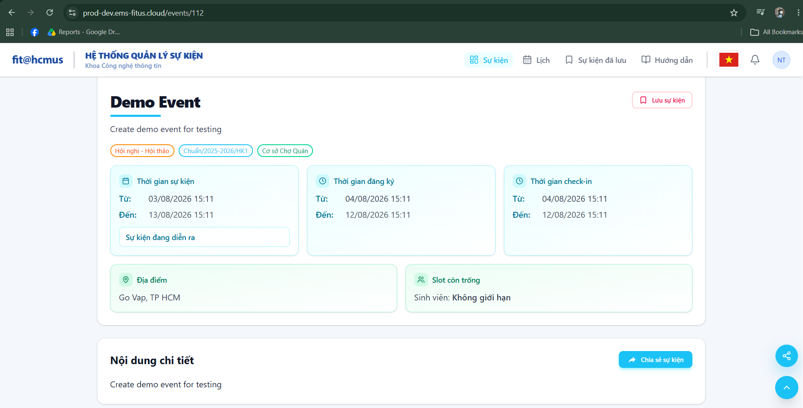
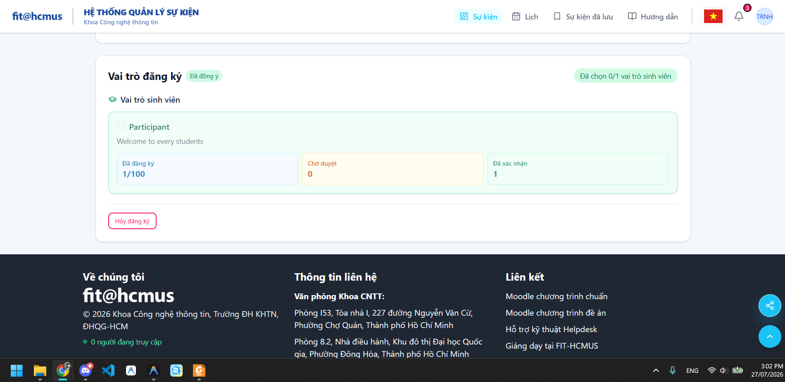
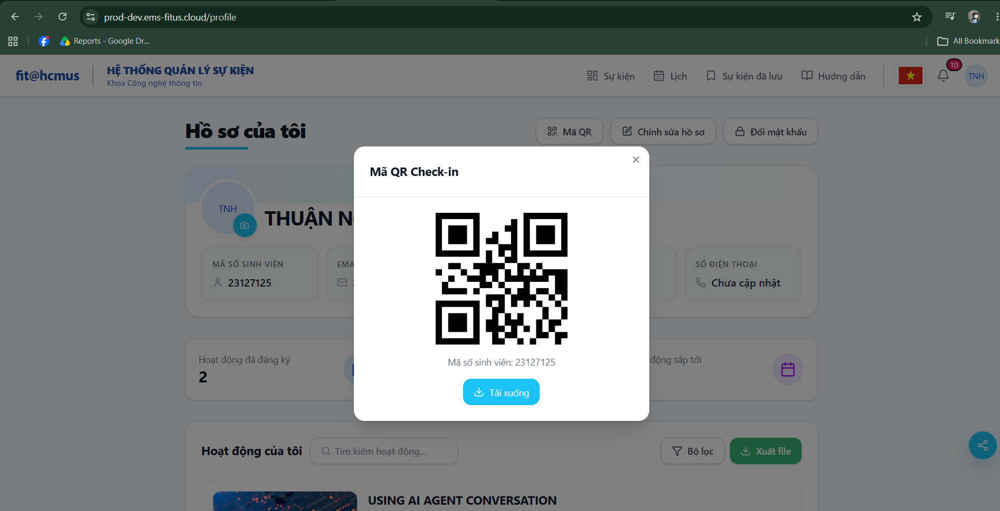

# Báo Cáo Kết Quả Kiểm Thử GUI & Usability (Main Report)

**Họ và tên:** NGUYỄN HIẾU THUẬN  
**MSSV:** 23127125  
**Kịch bản kiểm thử:** Scenario B — User registers to attend an event

---

## PHẦN 1: GIỚI THIỆU PHẠM VI (Introduction & Scope Selection)

### 1. Kịch Bản Kiểm Thử

Kịch bản B tập trung vào hành trình của một **Người tham gia (Participant)** từ lúc truy cập vào hệ thống Event Management System (EMS) cho đến khi tìm kiếm, xem chi tiết và đăng ký thành công một sự kiện để nhận vé.

### 2. Danh Sách Màn Hình Được Chọn Kiểm Thử

Bạn đã chọn thực hiện chạy test trên các màn hình sau:

1.  **Màn hình B1: Home / events listing**
    - _Mô tả:_ Trang chủ chứa carousel các sự kiện nổi bật (featured carousel), danh sách phân loại sự kiện (categories) và thanh tìm kiếm/lọc sự kiện.
    - _Lý do chọn:_ Đây là điểm chạm đầu tiên của người dùng, quyết định trải nghiệm khám phá và tìm kiếm sự kiện có dễ dàng hay không.
2.  **Màn hình B2: Event detail page**
    - _Mô tả:_ Trang chi tiết hiển thị thông tin đầy đủ về sự kiện bao gồm: ảnh banner chính, lịch trình chi tiết (schedule), thông tin diễn giả, trạng thái đăng ký, số chỗ trống còn lại và nút kích hoạt đăng ký.
    - _Lý do chọn:_ Màn hình này chứa nhiều thông tin phức tạp và các nút hành động cốt lõi quyết định việc người dùng có chuyển đổi sang đăng ký hay không.
3.  **Màn hình B3: Registration form**
    - _Mô tả:_ Form nhập liệu để đăng ký tham gia sự kiện. Chứa các lựa chọn vai trò (Student / Lecturer / Guest), trường nhập vai trò phụ (Additional Role) và các ô check xác nhận thông tin.
    - _Lý do chọn:_ Đây là biểu mẫu tương tác nhập liệu chính của kịch bản B, chứa nhiều logic validation nghiệp vụ phức tạp.

---

## PHẦN 2: KẾT QUẢ THỰC THI CHECKLIST GUI (Checklist Execution Results)

### Màn hình B1

#### Bảng Kết Quả Chạy Checklist GUI

| ID Checklist | Khía Cạnh      | Tiêu Chí Kiểm Tra                                                                                                                                         | Screen B1 (Pass/Fail/NA) | Ghi Chú Chi Tiết Lỗi / Link Minh Chứng                                                                                                                                                                                                                                                                                                                                                                                                                               |
| ------------ | -------------- | --------------------------------------------------------------------------------------------------------------------------------------------------------- | ------------------------ | -------------------------------------------------------------------------------------------------------------------------------------------------------------------------------------------------------------------------------------------------------------------------------------------------------------------------------------------------------------------------------------------------------------------------------------------------------------------- |
| **IA-01**    | **General UI** | **IA-01: General UI Standards (Layout, Typography, Color, Consistency, i18n)**                                                                            |                          |                                                                                                                                                                                                                                                                                                                                                                                                                                                                      |
| IA-01-01     | General UI     | Hệ thống lưới và khoảng cách (Grid & Spacing) căn lề nhất quán trên toàn màn hình.                                                                        | Pass                     |                                                                                                                                                                                                                                                                                                                                                                                                                                                                      |
| IA-01-02     | General UI     | Font chữ (typography) nhất quán về kích thước, độ dày (bold/regular) và phân cấp tiêu đề.                                                                 | Pass                     |                                                                                                                                                                                                                                                                                                                                                                                                                                                                      |
| IA-01-03     | General UI     | Màu sắc của các nút hành động (Primary, Secondary) và trạng thái nhất quán.                                                                               | Pass                     |                                                                                                                                                                                                                                                                                                                                                                                                                                                                      |
| IA-01-04     | General UI     | Đa ngôn ngữ (EN/VI) hoạt động đầy đủ, không bị dịch thiếu hoặc chồng lấp chữ.                                                                             | Fail                     | Tiêu đề và mô tả sự kiện không dịch: xem [BUG-B1-01](/bug_usability_findings_log.md) hoặc [Xem ảnh](images/bug_screenshots/Screen_B1_Bug_Da_Ngon_Ngu.png)                                                                                                                                                                                                                                                                                                            |
| IA-01-05     | General UI     | Trạng thái rỗng (Empty state) được hiển thị rõ ràng khi không có sự kiện/dữ liệu nào.                                                                     | Pass                     |                                                                                                                                                                                                                                                                                                                                                                                                                                                                      |
| IA-01-06     | General UI     | Trạng thái đang tải (Loading state/skeleton) hiển thị khi kéo dữ liệu chậm.                                                                               | Pass                     |                                                                                                                                                                                                                                                                                                                                                                                                                                                                      |
| IA-01-07     | General UI     | Trang web tương thích tốt và tự động co giãn (Responsive) trên màn hình.                                                                                  | Pass                     |                                                                                                                                                                                                                                                                                                                                                                                                                                                                      |
| IA-01-08     | General UI     | Các hình ảnh (Thumbnail/Banner) không bị méo tỉ lệ hiển thị (tỷ lệ 4:3 và 24:9) trên các kích thước màn hình khác nhau.                                   | Pass                     |                                                                                                                                                                                                                                                                                                                                                                                                                                                                      |
| IA-01-09     | General UI     | Các icon được căn chỉnh đúng tâm so với nhãn text bên cạnh.                                                                                               | Pass                     |                                                                                                                                                                                                                                                                                                                                                                                                                                                                      |
| IA-01-10     | General UI     | Độ tương phản màu sắc giữa văn bản và nền đủ rõ ràng (Accessibility WCAG).                                                                                | Pass                     |                                                                                                                                                                                                                                                                                                                                                                                                                                                                      |
| IA-01-11     | General UI     | Các liên kết ngoài (External links) mở ở tab mới, liên kết nội bộ (Internal links) mở ở tab hiện tại.                                                     | Pass                     |                                                                                                                                                                                                                                                                                                                                                                                                                                                                      |
| IA-01-12     | General UI     | Ảnh Thumbnail (4:3) và Banner (24:9) không bị cắt xén mất nội dung quan trọng.                                                                            | Fail                     | Ảnh banner bị cắt mất 2 bên: xem [BUG-B1-02](/bug_usability_findings_log.md) hoặc [Xem ảnh](images/bug_screenshots/Screen_B1_Bug_Anh_Mat_Noi_Dung_Quan_Trong.png)                                                                                                                                                                                                                                                                                                    |
| **IA-02**    | **Forms**      | **IA-02: Forms (Labels, Validation, Errors, Required Fields, Rich Text)**                                                                                 |                          |                                                                                                                                                                                                                                                                                                                                                                                                                                                                      |
| IA-02-01     | Forms          | Các trường bắt buộc nhập (Required fields) được đánh dấu ký hiệu trực quan (ví dụ dấu `*`).                                                               | NA                       |                                                                                                                                                                                                                                                                                                                                                                                                                                                                      |
| IA-02-02     | Forms          | Nhãn (Labels) của trường nhập liệu luôn hiển thị rõ ràng và đi sát với ô nhập liệu.                                                                       | NA                       |                                                                                                                                                                                                                                                                                                                                                                                                                                                                      |
| IA-02-03     | Forms          | Validation thời gian thực báo lỗi đỏ trực quan ngay dưới trường nhập liệu bị lỗi.                                                                         | NA                       |                                                                                                                                                                                                                                                                                                                                                                                                                                                                      |
| IA-02-04     | Forms          | Thông báo lỗi cụ thể, hướng dẫn cách khắc phục thay vì báo lỗi chung chung.                                                                               | Fail                     | Không báo lỗi khi nhập ngày kết thúc trước ngày bắt đầu: xem [BUG-B1-03](/bug_usability_findings_log.md) hoặc [Xem ảnh](images/bug_screenshots/Screen_B1_Bug_Khong_Bao_Loi_Ngay_Khong_Hop_Le.png)                                                                                                                                                                                                                                                                    |
| IA-02-05     | Forms          | Định dạng tải lên (Upload file/image) kiểm tra đúng định dạng và dung lượng tối đa.                                                                       | NA                       |                                                                                                                                                                                                                                                                                                                                                                                                                                                                      |
| IA-02-06     | Forms          | Trình soạn thảo Rich Text hiển thị đầy đủ thanh công cụ và hoạt động mượt mà.                                                                             | NA                       |                                                                                                                                                                                                                                                                                                                                                                                                                                                                      |
| IA-02-07     | Forms          | Người dùng có thể nhấn `Tab` để di chuyển tuần tự qua các ô nhập liệu trong form.                                                                         | Pass                     |                                                                                                                                                                                                                                                                                                                                                                                                                                                                      |
| IA-02-08     | Forms          | Các nút Submit/Save bị vô hiệu hóa (disabled) khi form chưa điền đủ thông tin hợp lệ.                                                                     | NA                       |                                                                                                                                                                                                                                                                                                                                                                                                                                                                      |
| IA-02-09     | Forms          | Định dạng ngày giờ hiển thị theo chuẩn cục bộ dễ đọc đối với người dùng Việt Nam.                                                                         | Pass                     |                                                                                                                                                                                                                                                                                                                                                                                                                                                                      |
| IA-02-10     | Forms          | Nút xóa nhanh (clear button) hoặc reset form hoạt động chính xác.                                                                                         | Pass                     |                                                                                                                                                                                                                                                                                                                                                                                                                                                                      |
| IA-02-11     | Forms          | Trình duyệt hỗ trợ tính năng tự động điền (autofill) cho các trường thông tin cơ bản.                                                                     | NA                       |                                                                                                                                                                                                                                                                                                                                                                                                                                                                      |
| IA-02-12     | Forms          | Ô nhập mật khẩu hỗ trợ tính năng toggle ẩn/hiện mật khẩu trực quan bằng biểu tượng con mắt.                                                               | NA                       |                                                                                                                                                                                                                                                                                                                                                                                                                                                                      |
| **IA-03**    | **Navigation** | **IA-03: Navigation (Menus, Breadcrumbs, Sidebar, Tabs, Back actions, Deep links)**                                                                       |                          |
| IA-03-01     | Navigation     | Menu điều hướng chính luôn cố định hoặc dễ dàng truy cập ở đầu trang/thanh bên.                                                                           | Pass                     |                                                                                                                                                                                                                                                                                                                                                                                                                                                                      |
| IA-03-02     | Navigation     | Trạng thái hiện tại của trang (Active state) được làm nổi bật trên menu điều hướng.                                                                       | Pass                     |                                                                                                                                                                                                                                                                                                                                                                                                                                                                      |
| IA-03-03     | Navigation     | Nút quay lại (Back/Return action) đưa người dùng về đúng trang trước đó, không mất trạng thái.                                                            | NA                       |                                                                                                                                                                                                                                                                                                                                                                                                                                                                      |
| IA-03-04     | Navigation     | Liên kết sâu (Deep links) dẫn trực tiếp đến trang chi tiết sự kiện mà không bị lỗi 404.                                                                   | Pass                     |                                                                                                                                                                                                                                                                                                                                                                                                                                                                      |
| IA-03-05     | Navigation     | Breadcrumbs hiển thị đúng phân cấp thư mục và có thể click để quay về thư mục cha.                                                                        | NA                       |                                                                                                                                                                                                                                                                                                                                                                                                                                                                      |
| IA-03-06     | Navigation     | Tính năng kéo thả thay đổi thứ tự (Reorder) hiển thị trực quan (dòng bị kéo mờ opacity-50) và các nút thao tác khác tạm thời bị vô hiệu hóa.              | NA                       |                                                                                                                                                                                                                                                                                                                                                                                                                                                                      |
| IA-03-07     | Navigation     | Các tab chuyển đổi nhanh hoạt động độc lập và tải đúng dữ liệu tương ứng.                                                                                 | Pass                     |                                                                                                                                                                                                                                                                                                                                                                                                                                                                      |
| IA-03-08     | Navigation     | Không có liên kết nào bị hỏng (Broken links / 404 error) trên toàn giao diện.                                                                             | Pass                     |                                                                                                                                                                                                                                                                                                                                                                                                                                                                      |
| IA-03-09     | Navigation     | Nút "Cuộn lên đầu trang" (Back to top) hiển thị khi người dùng cuộn xuống sâu (nếu có).                                                                   | Pass                     |                                                                                                                                                                                                                                                                                                                                                                                                                                                                      |
| IA-03-10     | Navigation     | Thanh bên sidebar có thể thu gọn/mở rộng mượt mà và không che khuất nội dung chính.                                                                       | Pass                     |                                                                                                                                                                                                                                                                                                                                                                                                                                                                      |
| IA-03-11     | Navigation     | Đường dẫn URL trên thanh địa chỉ thay đổi tương ứng khi chuyển đổi qua lại giữa các tab hoặc bộ lọc.                                                      | Fail                     | URL không đồng bộ khi lọc/chuyển tab: xem [BUG-B1-04](/bug_usability_findings_log.md) hoặc [Xem ảnh](images/bug_screenshots/Screen_B1_Bug_Duong_Dan_Khong_Thay_Doi.png)                                                                                                                                                                                                                                                                                              |
| IA-03-12     | Navigation     | Giao diện kéo thả (Reorder) hiển thị biểu tượng tay cầm (drag handle) rõ ràng để gợi ý khả năng tương tác.                                                | NA                       |                                                                                                                                                                                                                                                                                                                                                                                                                                                                      |
| **IA-04**    | **Feedback**   | **IA-04: Feedback & State (Toasts, Badges, Confirmations, Progress Bars, Status Colors)**                                                                 |                          |                                                                                                                                                                                                                                                                                                                                                                                                                                                                      |
| IA-04-01     | Feedback       | Thông báo nổi (Toasts) xuất hiện ngay sau khi thực hiện hành động và tự động tắt sau 3-5s.                                                                | Fail                     | Click "Lưu" không hiện Toast, trạng thái "Đã lưu" tự reset: xem [BUG-B1-05](/bug_usability_findings_log.md) hoặc [Xem ảnh](images/bug_screenshots/Screen_B1_Bug_Luu_Su_Kien_Khong_Hien_Toast.png), [BUG-B1-06](/bug_usability_findings_log.md) hoặc [Xem ảnh](images/bug_screenshots/Screen_B1_Bug_Bam_Luu_Su_Kien_Khong_Duoc_Giu_Nguyen_Trang_Thai_1.png) và [Xem ảnh](images/bug_screenshots/Screen_B1_Bug_Bam_Luu_Su_Kien_Khong_Duoc_Giu_Nguyen_Trang_Thai_2.png) |
| IA-04-02     | Feedback       | Toasts có màu sắc phân biệt rõ ràng: Xanh (Thành công), Đỏ (Lỗi), Vàng (Cảnh báo).                                                                        | Fail                     | Không xuất hiện Toast để kiểm tra màu sắc (Lỗi liên đới từ IA-04-01)                                                                                                                                                                                                                                                                                                                                                                                                 |
| IA-04-03     | Feedback       | Hộp thoại xác nhận (Confirmation dialog) xuất hiện trước các hành động hủy/xóa quan trọng.                                                                | NA                       |                                                                                                                                                                                                                                                                                                                                                                                                                                                                      |
| IA-04-04     | Feedback       | Huy hiệu (Badges) hiển thị chính xác số lượng thông báo; trạng thái vé thay đổi tương ứng khi được phê duyệt/hủy.                                         | Pass                     |                                                                                                                                                                                                                                                                                                                                                                                                                                                                      |
| IA-04-05     | Feedback       | Thanh tiến trình (Progress bar) hoặc vòng xoay tải (Spinner) xuất hiện khi hệ thống xử lý.                                                                | Pass                     |                                                                                                                                                                                                                                                                                                                                                                                                                                                                      |
| IA-04-06     | Feedback       | Trạng thái hiển thị màu sắc tương thích với ngữ nghĩa (Ví dụ: APPROVED màu xanh lá, REJECTED màu đỏ).                                                     | Pass                     |                                                                                                                                                                                                                                                                                                                                                                                                                                                                      |
| IA-04-07     | Feedback       | Chấm đỏ thông báo (Notification dot) hiển thị động ngay khi có thay đổi trạng thái đăng ký.                                                               | Pass                     |                                                                                                                                                                                                                                                                                                                                                                                                                                                                      |
| IA-04-08     | Feedback       | Hộp thoại chi tiết ảnh (Lightbox) mở rộng mượt mà khi click vào ảnh đính kèm.                                                                             | NA                       |                                                                                                                                                                                                                                                                                                                                                                                                                                                                      |
| IA-04-09     | Feedback       | Cập nhật dữ liệu thời gian thực (Real-time update) mà không cần người dùng reload trang.                                                                  | Pass                     |                                                                                                                                                                                                                                                                                                                                                                                                                                                                      |
| IA-04-10     | Feedback       | Hiển thị thông báo rõ ràng khi mất kết nối mạng Internet.                                                                                                 | Fail                     | Không cảnh báo khi mất kết nối mạng: xem [BUG-B1-07](/bug_usability_findings_log.md) hoặc [Xem ảnh](images/bug_screenshots/Screen_B1_Bug_Khong_Thong_Bao_Mat_Internet.png)                                                                                                                                                                                                                                                                                           |
| IA-04-11     | Feedback       | Hệ thống vô hiệu hóa nút gửi hoặc ngăn chặn gửi dữ liệu trùng lặp khi người dùng click đúp nút Submit.                                                    | NA                       |                                                                                                                                                                                                                                                                                                                                                                                                                                                                      |
| IA-04-12     | Feedback       | Mã QR/Barcode trên vé hiển thị rõ nét (không bị mờ), có kích thước tối thiểu đảm bảo quét được bằng ứng dụng camera thông thường.                         | NA                       |                                                                                                                                                                                                                                                                                                                                                                                                                                                                      |
| IA-04-13     | Feedback       | Ô nhập liệu (text box) hiển thị hiệu ứng viền/nổi bật trực quan (focus state) khi nhấp chuột vào để người dùng nhận biết rõ ràng đang thao tác/nhập liệu. | Pass                     |                                                                                                                                                                                                                                                                                                                                                                                                                                                                      |
| IA-04-14 | Feedback | Các nút secondary actions phải được vô hiệu hóa (disabled + đổi con trỏ) khi không có gì để thực hiện, hoặc phải hiển thị phản hồi rõ ràng (toast/thông báo) nếu vẫn cho phép bấm mà không có tác dụng gì | Pass | |

### Màn hình B2

#### Bảng Kết Quả Chạy Checklist GUI

| ID Checklist | Khía Cạnh      | Tiêu Chí Kiểm Tra                                                                                                                                         | Screen B2 (Pass/Fail/NA) | Ghi Chú Chi Tiết Lỗi / Link Minh Chứng                                                                                                                                                                                                                                                                                                                                                                                                                                   |
| ------------ | -------------- | --------------------------------------------------------------------------------------------------------------------------------------------------------- | ------------------------ | ------------------------------------------------------------------------------------------------------------------------------------------------------------------------------------------------------------------------------------------------------------------------------------------------------------------------------------------------------------------------------------------------------------------------------------------------------------------------ |
| **IA-01**    | **General UI** | **IA-01: General UI Standards (Layout, Typography, Color, Consistency, i18n)**                                                                            |                          |                                                                                                                                                                                                                                                                                                                                                                                                                                                                          |
| IA-01-01     | General UI     | Hệ thống lưới và khoảng cách (Grid & Spacing) căn lề nhất quán trên toàn màn hình.                                                                        | Pass                     |                                                                                                                                                                                                                                                                                                                                                                                                                                                                          |
| IA-01-02     | General UI     | Font chữ (typography) nhất quán về kích thước, độ dày (bold/regular) và phân cấp tiêu đề.                                                                 | Pass                     |                                                                                                                                                                                                                                                                                                                                                                                                                                                                          |
| IA-01-03     | General UI     | Màu sắc của các nút hành động (Primary, Secondary) và trạng thái nhất quán.                                                                               | Pass                     |                                                                                                                                                                                                                                                                                                                                                                                                                                                                          |
| IA-01-04     | General UI     | Đa ngôn ngữ (EN/VI) hoạt động đầy đủ, không bị dịch thiếu hoặc chồng lấp chữ.                                                                             | Fail                     | Tiêu đề và mô tả sự kiện không dịch: xem [BUG-B2-01](/bug_usability_findings_log.md) hoặc [Xem ảnh](images/bug_screenshots/Screen_B2_Bug_Da_Ngon_Ngu.png)                                                                                                                                                                                                                                                                                                                |
| IA-01-05     | General UI     | Trạng thái rỗng (Empty state) được hiển thị rõ ràng khi không có sự kiện/dữ liệu nào.                                                                     | Pass                     |                                                                                                                                                                                                                                                                                                                                                                                                                                                                          |
| IA-01-06     | General UI     | Trạng thái đang tải (Loading state/skeleton) hiển thị khi kéo dữ liệu chậm.                                                                               | Pass                     |                                                                                                                                                                                                                                                                                                                                                                                                                                                                          |
| IA-01-07     | General UI     | Trang web tương thích tốt và tự động co giãn (Responsive) trên màn hình.                                                                                  | Pass                     |                                                                                                                                                                                                                                                                                                                                                                                                                                                                          |
| IA-01-08     | General UI     | Các hình ảnh (Thumbnail/Banner) không bị méo tỉ lệ hiển thị (tỷ lệ 4:3 và 24:9) trên các kích thước màn hình khác nhau.                                   | Pass                     |                                                                                                                                                                                                                                                                                                                                                                                                                                                                          |
| IA-01-09     | General UI     | Các icon được căn chỉnh đúng tâm so với nhãn text bên cạnh.                                                                                               | Pass                     |                                                                                                                                                                                                                                                                                                                                                                                                                                                                          |
| IA-01-10     | General UI     | Độ tương phản màu sắc giữa văn bản và nền đủ rõ ràng (Accessibility WCAG).                                                                                | Pass                     |                                                                                                                                                                                                                                                                                                                                                                                                                                                                          |
| IA-01-11     | General UI     | Các liên kết ngoài (External links) mở ở tab mới, liên kết nội bộ (Internal links) mở ở tab hiện tại.                                                     | Pass                     |                                                                                                                                                                                                                                                                                                                                                                                                                                                                          |
| IA-01-12     | General UI     | Ảnh Thumbnail (4:3) và Banner (24:9) không bị cắt xén mất nội dung quan trọng.                                                                            | Pass                     |                                                                                                                                                                                                                                                                                                                                                                                                                                                                          |
| **IA-02**    | **Forms**      | **IA-02: Forms (Labels, Validation, Errors, Required Fields, Rich Text)**                                                                                 |                          |                                                                                                                                                                                                                                                                                                                                                                                                                                                                          |
| IA-02-01     | Forms          | Các trường bắt buộc nhập (Required fields) được đánh dấu ký hiệu trực quan (ví dụ dấu `*`).                                                               | NA                       |                                                                                                                                                                                                                                                                                                                                                                                                                                                                          |
| IA-02-02     | Forms          | Nhãn (Labels) của trường nhập liệu luôn hiển thị rõ ràng và đi sát với ô nhập liệu.                                                                       | NA                       |                                                                                                                                                                                                                                                                                                                                                                                                                                                                          |
| IA-02-03     | Forms          | Validation thời gian thực báo lỗi đỏ trực quan ngay dưới trường nhập liệu bị lỗi.                                                                         | NA                       |                                                                                                                                                                                                                                                                                                                                                                                                                                                                          |
| IA-02-04     | Forms          | Thông báo lỗi cụ thể, hướng dẫn cách khắc phục thay vì báo lỗi chung chung.                                                                               | NA                       |                                                                                                                                                                                                                                                                                                                                                                                                                                                                          |
| IA-02-05     | Forms          | Định dạng tải lên (Upload file/image) kiểm tra đúng định dạng và dung lượng tối đa.                                                                       | NA                       |                                                                                                                                                                                                                                                                                                                                                                                                                                                                          |
| IA-02-06     | Forms          | Trình soạn thảo Rich Text hiển thị đầy đủ thanh công cụ và hoạt động mượt mà.                                                                             | NA                       |                                                                                                                                                                                                                                                                                                                                                                                                                                                                          |
| IA-02-07     | Forms          | Người dùng có thể nhấn `Tab` để di chuyển tuần tự qua các ô nhập liệu trong form.                                                                         | NA                       |                                                                                                                                                                                                                                                                                                                                                                                                                                                                          |
| IA-02-08     | Forms          | Các nút Submit/Save bị vô hiệu hóa (disabled) khi form chưa điền đủ thông tin hợp lệ.                                                                     | NA                       |                                                                                                                                                                                                                                                                                                                                                                                                                                                                          |
| IA-02-09     | Forms          | Định dạng ngày giờ hiển thị theo chuẩn cục bộ dễ đọc đối với người dùng Việt Nam.                                                                         | Pass                     |                                                                                                                                                                                                                                                                                                                                                                                                                                                                          |
| IA-02-10     | Forms          | Nút xóa nhanh (clear button) hoặc reset form hoạt động chính xác.                                                                                         | NA                       |                                                                                                                                                                                                                                                                                                                                                                                                                                                                          |
| IA-02-11     | Forms          | Trình duyệt hỗ trợ tính năng tự động điền (autofill) cho các trường thông tin cơ bản.                                                                     | NA                       |                                                                                                                                                                                                                                                                                                                                                                                                                                                                          |
| IA-02-12     | Forms          | Ô nhập mật khẩu hỗ trợ tính năng toggle ẩn/hiện mật khẩu trực quan bằng biểu tượng con mắt.                                                               | NA                       |                                                                                                                                                                                                                                                                                                                                                                                                                                                                          |
| **IA-03**    | **Navigation** | **IA-03: Navigation (Menus, Breadcrumbs, Sidebar, Tabs, Back actions, Deep links)**                                                                       |                          |                                                                                                                                                                                                                                                                                                                                                                                                                                                                          |
| IA-03-01     | Navigation     | Menu điều hướng chính luôn cố định hoặc dễ dàng truy cập ở đầu trang/thanh bên.                                                                           | Pass                     |                                                                                                                                                                                                                                                                                                                                                                                                                                                                          |
| IA-03-02     | Navigation     | Trạng thái hiện tại của trang (Active state) được làm nổi bật trên menu điều hướng.                                                                       | Pass                     |                                                                                                                                                                                                                                                                                                                                                                                                                                                                          |
| IA-03-03     | Navigation     | Nút quay lại (Back/Return action) đưa người dùng về đúng trang trước đó, không mất trạng thái.                                                            | Pass                     |                                                                                                                                                                                                                                                                                                                                                                                                                                                                          |
| IA-03-04     | Navigation     | Liên kết sâu (Deep links) dẫn trực tiếp đến trang chi tiết sự kiện mà không bị lỗi 404.                                                                   | Pass                     |                                                                                                                                                                                                                                                                                                                                                                                                                                                                          |
| IA-03-05     | Navigation     | Breadcrumbs hiển thị đúng phân cấp thư mục và có thể click để quay về thư mục cha.                                                                        | NA                       |                                                                                                                                                                                                                                                                                                                                                                                                                                                                          |
| IA-03-06     | Navigation     | Tính năng kéo thả thay đổi thứ tự (Reorder) hiển thị trực quan (dòng bị kéo mờ opacity-50) và các nút thao tác khác tạm thời bị vô hiệu hóa.              | NA                       |                                                                                                                                                                                                                                                                                                                                                                                                                                                                          |
| IA-03-07     | Navigation     | Các tab chuyển đổi nhanh hoạt động độc lập và tải đúng dữ liệu tương ứng.                                                                                 | Pass                     |                                                                                                                                                                                                                                                                                                                                                                                                                                                                          |
| IA-03-08     | Navigation     | Không có liên kết nào bị hỏng (Broken links / 404 error) trên toàn giao diện.                                                                             | Pass                     |                                                                                                                                                                                                                                                                                                                                                                                                                                                                          |
| IA-03-09     | Navigation     | Nút "Cuộn lên đầu trang" (Back to top) hiển thị khi người dùng cuộn xuống sâu (nếu có).                                                                   | Pass                     |                                                                                                                                                                                                                                                                                                                                                                                                                                                                          |
| IA-03-10     | Navigation     | Thanh bên sidebar có thể thu gọn/mở rộng mượt mà và không che khuất nội dung chính.                                                                       | NA                       |                                                                                                                                                                                                                                                                                                                                                                                                                                                                          |
| IA-03-11     | Navigation     | Đường dẫn URL trên thanh địa chỉ thay đổi tương ứng khi chuyển đổi qua lại giữa các tab hoặc bộ lọc.                                                      | Pass                     |                                                                                                                                                                                                                                                                                                                                                                                                                                                                          |
| IA-03-12     | Navigation     | Giao diện kéo thả (Reorder) hiển thị biểu tượng tay cầm (drag handle) rõ ràng để gợi ý khả năng tương tác.                                                | NA                       |                                                                                                                                                                                                                                                                                                                                                                                                                                                                          |
| **IA-04**    | **Feedback**   | **IA-04: Feedback & State (Toasts, Badges, Confirmations, Progress Bars, Status Colors)**                                                                 |                          |                                                                                                                                                                                                                                                                                                                                                                                                                                                                          |
| IA-04-01     | Feedback       | Thông báo nổi (Toasts) xuất hiện ngay sau khi thực hiện hành động và tự động tắt sau 3-5s.                                                                | Fail                     | Click "Lưu" không hiện Toast, trạng thái "Đã lưu" tự reset: xem [BUG-B2-02](/bug_usability_findings_log.md) hoặc [Xem ảnh](images/bug_screenshots/Screen_B2_Bug_Luu_Su_Kien_Khong_Hien_Toast.png), [BUG-B2-03](/bug_usability_findings_log.md) hoặc [Xem ảnh 1](images/bug_screenshots/Screen_B2_Bug_Bam_Luu_Su_Kien_Khong_Duoc_Giu_Nguyen_Trang_Thai_1.png) và [Xem ảnh 2](images/bug_screenshots/Screen_B2_Bug_Bam_Luu_Su_Kien_Khong_Duoc_Giu_Nguyen_Trang_Thai_2.png) |
| IA-04-02     | Feedback       | Toasts có màu sắc phân biệt rõ ràng: Xanh (Thành công), Đỏ (Lỗi), Vàng (Cảnh báo).                                                                        | Fail                     | Không xuất hiện Toast để kiểm tra màu sắc (Lỗi liên đới từ IA-04-01): xem [BUG-B2-02](/bug_usability_findings_log.md)                                                                                                                                                                                                                                                                                                                                                    |
| IA-04-03     | Feedback       | Hộp thoại xác nhận (Confirmation dialog) xuất hiện trước các hành động hủy/xóa quan trọng.                                                                | NA                       |                                                                                                                                                                                                                                                                                                                                                                                                                                                                          |
| IA-04-04     | Feedback       | Huy hiệu (Badges) hiển thị chính xác số lượng thông báo; trạng thái vé thay đổi tương ứng khi được phê duyệt/hủy.                                         | Pass                     |                                                                                                                                                                                                                                                                                                                                                                                                                                                                          |
| IA-04-05     | Feedback       | Thanh tiến trình (Progress bar) hoặc vòng xoay tải (Spinner) xuất hiện khi hệ thống xử lý.                                                                | Pass                     |                                                                                                                                                                                                                                                                                                                                                                                                                                                                          |
| IA-04-06     | Feedback       | Trạng thái hiển thị màu sắc tương thích với ngữ nghĩa (Ví dụ: APPROVED màu xanh lá, REJECTED màu đỏ).                                                     | Pass                     |                                                                                                                                                                                                                                                                                                                                                                                                                                                                          |
| IA-04-07     | Feedback       | Chấm đỏ thông báo (Notification dot) hiển thị động ngay khi có thay đổi trạng thái đăng ký.                                                               | Pass                     |                                                                                                                                                                                                                                                                                                                                                                                                                                                                          |
| IA-04-08     | Feedback       | Hộp thoại chi tiết ảnh (Lightbox) mở rộng mượt mà khi click vào ảnh đính kèm.                                                                             | NA                       |                                                                                                                                                                                                                                                                                                                                                                                                                                                                          |
| IA-04-09     | Feedback       | Cập nhật dữ liệu thời gian thực (Real-time update) mà không cần người dùng reload trang.                                                                  | Pass                     |                                                                                                                                                                                                                                                                                                                                                                                                                                                                          |
| IA-04-10     | Feedback       | Hiển thị thông báo rõ ràng khi mất kết nối mạng Internet.                                                                                                 | Fail                     | Không cảnh báo khi mất kết nối mạng: xem [BUG-B2-04](/bug_usability_findings_log.md) hoặc [Xem ảnh](images/bug_screenshots/Screen_B2_Bug_Khong_Thong_Bao_Mat_Internet.png)                                                                                                                                                                                                                                                                                               |
| IA-04-11     | Feedback       | Hệ thống vô hiệu hóa nút gửi hoặc ngăn chặn gửi dữ liệu trùng lặp khi người dùng click đúp nút Submit.                                                    | NA                       |                                                                                                                                                                                                                                                                                                                                                                                                                                                                          |
| IA-04-12     | Feedback       | Mã QR/Barcode trên vé hiển thị rõ nét (không bị mờ), có kích thước tối thiểu đảm bảo quét được bằng ứng dụng camera thông thường.                         | NA                       |                                                                                                                                                                                                                                                                                                                                                                                                                                                                          |
| IA-04-13     | Feedback       | Ô nhập liệu (text box) hiển thị hiệu ứng viền/nổi bật trực quan (focus state) khi nhấp chuột vào để người dùng nhận biết rõ ràng đang thao tác/nhập liệu. | NA                       |                                                                                                                                                                                                                                                                                                                                                                                                                                                                          |
| IA-04-14 | Feedback | Các nút secondary actions phải được vô hiệu hóa (disabled + đổi con trỏ) khi không có gì để thực hiện, hoặc phải hiển thị phản hồi rõ ràng (toast/thông báo) nếu vẫn cho phép bấm mà không có tác dụng gì | Pass | |

### Màn hình B3

#### Bảng Kết Quả Chạy Checklist GUI

| ID Checklist | Khía Cạnh      | Tiêu Chí Kiểm Tra                                                                                                                                         | Screen B3 (Pass/Fail/NA) | Ghi Chú Chi Tiết Lỗi / Link Minh Chứng                                                                                                                                                                          |
| ------------ | -------------- | --------------------------------------------------------------------------------------------------------------------------------------------------------- | ------------------------ | --------------------------------------------------------------------------------------------------------------------------------------------------------------------------------------------------------------- |
| **IA-01**    | **General UI** | **IA-01: General UI Standards (Layout, Typography, Color, Consistency, i18n)**                                                                            |                          |                                                                                                                                                                                                                 |
| IA-01-01     | General UI     | Hệ thống lưới và khoảng cách (Grid & Spacing) căn lề nhất quán trên toàn màn hình.                                                                        | Pass                     |                                                                                                                                                                                                                 |
| IA-01-02     | General UI     | Font chữ (typography) nhất quán về kích thước, độ dày (bold/regular) và phân cấp tiêu đề.                                                                 | Pass                     |                                                                                                                                                                                                                 |
| IA-01-03     | General UI     | Màu sắc của các nút hành động (Primary, Secondary) và trạng thái nhất quán.                                                                               | Pass                     |                                                                                                                                                                                                                 |
| IA-01-04     | General UI     | Đa ngôn ngữ (EN/VI) hoạt động đầy đủ, không bị dịch thiếu hoặc chồng lấp chữ.                                                                             | Fail                     | Tên role tham dự và mô tả role không được dịch: xem [BUG-B3-01](/bug_usability_findings_log.md) hoặc [Xem ảnh](images/bug_screenshots/Screen_B3_Bug_Da_Ngon_Ngu.png)                                            |
| IA-01-05     | General UI     | Trạng thái rỗng (Empty state) được hiển thị rõ ràng khi không có sự kiện/dữ liệu nào.                                                                     | Pass                     |                                                                                                                                                                                                                 |
| IA-01-06     | General UI     | Trạng thái đang tải (Loading state/skeleton) hiển thị khi kéo dữ liệu chậm.                                                                               | Pass                     |                                                                                                                                                                                                                 |
| IA-01-07     | General UI     | Trang web tương thích tốt và tự động co giãn (Responsive) trên màn hình.                                                                                  | Pass                     |                                                                                                                                                                                                                 |
| IA-01-08     | General UI     | Các hình ảnh (Thumbnail/Banner) không bị méo tỉ lệ hiển thị (tỷ lệ 4:3 và 24:9) trên các kích thước màn hình khác nhau.                                   | NA                       |                                                                                                                                                                                                                 |
| IA-01-09     | General UI     | Các icon được căn chỉnh đúng tâm so với nhãn text bên cạnh.                                                                                               | Pass                     |                                                                                                                                                                                                                 |
| IA-01-10     | General UI     | Độ tương phản màu sắc giữa văn bản và nền đủ rõ ràng (Accessibility WCAG).                                                                                | Pass                     |                                                                                                                                                                                                                 |
| IA-01-11     | General UI     | Các liên kết ngoài (External links) mở ở tab mới, liên kết nội bộ (Internal links) mở ở tab hiện tại.                                                     | NA                       |                                                                                                                                                                                                                 |
| IA-01-12     | General UI     | Ảnh Thumbnail (4:3) và Banner (24:9) không bị cắt xén mất nội dung quan trọng.                                                                            | NA                       |                                                                                                                                                                                                                 |
| **IA-02**    | **Forms**      | **IA-02: Forms (Labels, Validation, Errors, Required Fields, Rich Text)**                                                                                 |                          |                                                                                                                                                                                                                 |
| IA-02-01     | Forms          | Các trường bắt buộc nhập (Required fields) được đánh dấu ký hiệu trực quan (ví dụ dấu `*`).                                                               | NA                       |                                                                                                                                                                                                                 |
| IA-02-02     | Forms          | Nhãn (Labels) của trường nhập liệu luôn hiển thị rõ ràng và đi sát với ô nhập liệu.                                                                       | Pass                     |                                                                                                                                                                                                                 |
| IA-02-03     | Forms          | Validation thời gian thực báo lỗi đỏ trực quan ngay dưới trường nhập liệu bị lỗi.                                                                         | NA                       |                                                                                                                                                                                                                 |
| IA-02-04     | Forms          | Thông báo lỗi cụ thể, hướng dẫn cách khắc phục thay vì báo lỗi chung chung.                                                                               | NA                       |                                                                                                                                                                                                                 |
| IA-02-05     | Forms          | Định dạng tải lên (Upload file/image) kiểm tra đúng định dạng và dung lượng tối đa.                                                                       | NA                       |                                                                                                                                                                                                                 |
| IA-02-06     | Forms          | Trình soạn thảo Rich Text hiển thị đầy đủ thanh công cụ và hoạt động mượt mà.                                                                             | NA                       |                                                                                                                                                                                                                 |
| IA-02-07     | Forms          | Người dùng có thể nhấn `Tab` để di chuyển tuần tự qua các ô nhập liệu trong form.                                                                         | Pass                     |                                                                                                                                                                                                                 |
| IA-02-08     | Forms          | Các nút Submit/Save bị vô hiệu hóa (disabled) khi form chưa điền đủ thông tin hợp lệ.                                                                     | Pass                     |                                                                                                                                                                                                                 |
| IA-02-09     | Forms          | Định dạng ngày giờ hiển thị theo chuẩn cục bộ dễ đọc đối với người dùng Việt Nam.                                                                         | NA                       |                                                                                                                                                                                                                 |
| IA-02-10     | Forms          | Nút xóa nhanh (clear button) hoặc reset form hoạt động chính xác.                                                                                         | NA                       |                                                                                                                                                                                                                 |
| IA-02-11     | Forms          | Trình duyệt hỗ trợ tính năng tự động điền (autofill) cho các trường thông tin cơ bản.                                                                     | NA                       |                                                                                                                                                                                                                 |
| IA-02-12     | Forms          | Ô nhập mật khẩu hỗ trợ tính năng toggle ẩn/hiện mật khẩu trực quan bằng biểu tượng con mắt.                                                               | NA                       |                                                                                                                                                                                                                 |
| **IA-03**    | **Navigation** | **IA-03: Navigation (Menus, Breadcrumbs, Sidebar, Tabs, Back actions, Deep links)**                                                                       |                          |                                                                                                                                                                                                                 |
| IA-03-01     | Navigation     | Menu điều hướng chính luôn cố định hoặc dễ dàng truy cập ở đầu trang/thanh bên.                                                                           | Pass                     |                                                                                                                                                                                                                 |
| IA-03-02     | Navigation     | Trạng thái hiện tại của trang (Active state) được làm nổi bật trên menu điều hướng.                                                                       | Pass                     |                                                                                                                                                                                                                 |
| IA-03-03     | Navigation     | Nút quay lại (Back/Return action) đưa người dùng về đúng trang trước đó, không mất trạng thái.                                                            | Pass                     |                                                                                                                                                                                                                 |
| IA-03-04     | Navigation     | Liên kết sâu (Deep links) dẫn trực tiếp đến trang chi tiết sự kiện mà không bị lỗi 404.                                                                   | NA                       |                                                                                                                                                                                                                 |
| IA-03-05     | Navigation     | Breadcrumbs hiển thị đúng phân cấp thư mục và có thể click để quay về thư mục cha.                                                                        | NA                       |                                                                                                                                                                                                                 |
| IA-03-06     | Navigation     | Tính năng kéo thả thay đổi thứ tự (Reorder) hiển thị trực quan (dòng bị kéo mờ opacity-50) và các nút thao tác khác tạm thời bị vô hiệu hóa.              | NA                       |                                                                                                                                                                                                                 |
| IA-03-07     | Navigation     | Các tab chuyển đổi nhanh hoạt động độc lập và tải đúng dữ liệu tương ứng.                                                                                 | Pass                     |                                                                                                                                                                                                                 |
| IA-03-08     | Navigation     | Không có liên kết nào bị hỏng (Broken links / 404 error) trên toàn giao diện.                                                                             | Pass                     |                                                                                                                                                                                                                 |
| IA-03-09     | Navigation     | Nút "Cuộn lên đầu trang" (Back to top) hiển thị khi người dùng cuộn xuống sâu (nếu có).                                                                   | NA                       |                                                                                                                                                                                                                 |
| IA-03-10     | Navigation     | Thanh bên sidebar có thể thu gọn/mở rộng mượt mà và không che khuất nội dung chính.                                                                       | NA                       |                                                                                                                                                                                                                 |
| IA-03-11     | Navigation     | Đường dẫn URL trên thanh địa chỉ thay đổi tương ứng khi chuyển đổi qua lại giữa các tab hoặc bộ lọc.                                                      | NA                       |                                                                                                                                                                                                                 |
| IA-03-12     | Navigation     | Giao diện kéo thả (Reorder) hiển thị biểu tượng tay cầm (drag handle) rõ ràng để gợi ý khả năng tương tác.                                                | NA                       |                                                                                                                                                                                                                 |
| **IA-04**    | **Feedback**   | **IA-04: Feedback & State (Toasts, Badges, Confirmations, Progress Bars, Status Colors)**                                                                 |                          |                                                                                                                                                                                                                 |
| IA-04-01     | Feedback       | Thông báo nổi (Toasts) xuất hiện ngay sau khi thực hiện hành động và tự động tắt sau 3-5s.                                                                | Fail                     | Bấm đăng ký không hiện Toast: xem [BUG-B3-02](/bug_usability_findings_log.md) hoặc [Xem ảnh](images/bug_screenshots/Screen_B3_Bug_Dang_Ki_Su_Kien_Khong_Hien_Toast.png)                                         |
| IA-04-02     | Feedback       | Toasts có màu sắc phân biệt rõ ràng: Xanh (Thành công), Đỏ (Lỗi), Vàng (Cảnh báo).                                                                        | Fail                     | Không xuất hiện Toast để kiểm tra màu sắc (Lỗi liên đới từ IA-04-01): xem [BUG-B3-02](/bug_usability_findings_log.md)                                                                                           |
| IA-04-03     | Feedback       | Hộp thoại xác nhận (Confirmation dialog) xuất hiện trước các hành động hủy/xóa quan trọng.                                                                | Pass                     |                                                                                                                                                                                                                 |
| IA-04-04     | Feedback       | Huy hiệu (Badges) hiển thị chính xác số lượng thông báo; trạng thái vé thay đổi tương ứng khi được phê duyệt/hủy.                                         | Fail                     | Tải lại trang hiển thị sai số lượng vai trò đã đăng ký thành công (0/1): xem [BUG-B3-03](/bug_usability_findings_log.md) hoặc [Xem ảnh](images/bug_screenshots/Screen_B3_Bug_Hien_Thi_Sai_So_Luong_Dang_Ky.png) |
| IA-04-05     | Feedback       | Thanh tiến trình (Progress bar) hoặc vòng xoay tải (Spinner) xuất hiện khi hệ thống xử lý.                                                                | Pass                     |                                                                                                                                                                                                                 |
| IA-04-06     | Feedback       | Trạng thái hiển thị màu sắc tương thích với ngữ nghĩa (Ví dụ: APPROVED màu xanh lá, REJECTED màu đỏ).                                                     | Pass                     |                                                                                                                                                                                                                 |
| IA-04-07     | Feedback       | Chấm đỏ thông báo (Notification dot) hiển thị động ngay khi có thay đổi trạng thái đăng ký.                                                               | Fail                     | Bấm đăng ký không hiển thị chấm thông báo Noti: xem [BUG-B3-04](/bug_usability_findings_log.md) hoặc [Xem ảnh](images/bug_screenshots/Screen_B3_Bug_Dang_Ki_Su_Kien_Khong_Hien_Thong_Bao_Noti.png)              |
| IA-04-08     | Feedback       | Hộp thoại chi tiết ảnh (Lightbox) mở rộng mượt mà khi click vào ảnh đính kèm.                                                                             | NA                       |                                                                                                                                                                                                                 |
| IA-04-09     | Feedback       | Cập nhật dữ liệu thời gian thực (Real-time update) mà không cần người dùng reload trang.                                                                  | Fail                     | Khi được phê duyệt, UI không tự cập nhật trạng thái mà phải F5: xem [BUG-B3-05](/bug_usability_findings_log.md) hoặc [Xem ảnh](images/bug_screenshots/Screen_B3_Bug_Khong_Tu_Cap_Nhat_UI.png)                   |
| IA-04-10     | Feedback       | Hiển thị thông báo rõ ràng khi mất kết nối mạng Internet.                                                                                                 | Fail                     | Không có thông báo gì khi bị ngắt kết nối internet: xem [BUG-B3-06](/bug_usability_findings_log.md) hoặc [Xem ảnh](images/bug_screenshots/Screen_B3_Bug_Khong_Thong_Bao_Mat_Internet.png)                       |
| IA-04-11     | Feedback       | Hệ thống vô hiệu hóa nút gửi hoặc ngăn chặn gửi dữ liệu trùng lặp khi người dùng click đúp nút Submit.                                                    | NA                       |                                                                                                                                                                                                                 |
| IA-04-12     | Feedback       | Mã QR/Barcode trên vé hiển thị rõ nét (không bị mờ), có kích thước tối thiểu đảm bảo quét được bằng ứng dụng camera thông thường.                         | NA                       |                                                                                                                                                                                                                 |
| IA-04-13     | Feedback       | Ô nhập liệu (text box) hiển thị hiệu ứng viền/nổi bật trực quan (focus state) khi nhấp chuột vào để người dùng nhận biết rõ ràng đang thao tác/nhập liệu. | Pass                     |                                                                                                                                                                                                                 |
| IA-04-14 | Feedback | Các nút secondary actions phải được vô hiệu hóa (disabled + đổi con trỏ) khi không có gì để thực hiện, hoặc phải hiển thị phản hồi rõ ràng (toast/thông báo) nếu vẫn cho phép bấm mà không có tác dụng gì | NA | |

---

## PHẦN 3: BÁO CÁO USABILITY TESTING (Usability Report)

### 1. Kịch Bản Nhiệm Vụ (Task Scenario Overview)

_Kịch bản được thiết kế định hướng mục tiêu (Goal-oriented) giao cho người dùng:_

> **"Bạn là một sinh viên đang tìm kiếm cơ hội tham gia các buổi workshop học thuật để tích lũy điểm rèn luyện. Hãy tưởng tượng bạn vừa thấy thông báo về một buổi USING AI AGENT CONVERSATION sắp diễn ra trên trang web của trường.**  
> **Nhiệm vụ của bạn:** Truy cập EMS $\rightarrow$ Tìm kiếm sự kiện **USING AI AGENT CONVERSATION** $\rightarrow$ Xem lịch trình & thông tin $\rightarrow$ Đăng ký tham gia với vai trò chính là **Người tham dự (Participant)** và vai trò phụ **Khách tham quan (Visitor)** $\rightarrow$ Chờ Admin duyệt (khoảng 1 phút) $\rightarrow$ Mở mã **QR vé cá nhân** để sẵn sàng check-in vào cửa."  
> _(Xem kịch bản chi tiết tại file [task_scenario.md](/user_testing_evidence/task_scenario.md) và hướng dẫn thử nghiệm tại [test_request.md](/user_testing_evidence/test_request.md))._

### 2. Danh Sách Người Tham Gia Thử Nghiệm (Participants)

_(Thông tin 5 người dùng thật ngoài lớp học, số điện thoại và email được che 4 chữ số ở giữa theo quy định bảo mật)_

| STT   | Người dùng (Viết tắt) | Vai trò thực tế | Thông tin liên lạc (SĐT / Email)           | Trình độ công nghệ | Môi trường thử nghiệm      |
| ----- | --------------------- | --------------- | ------------------------------------------ | ------------------ | -------------------------- |
| **1** | Nguyễn Đ. M. D        | Sinh viên FIT   | `088****119` / `ndmduy23@clc.fitus.edu.vn` | Cao                | Desktop (Windows / Chrome) |
| **2** | Nguyễn V. M. Q        | Sinh viên FIT   | `077****444` / `nvmquang23@clc.fitus.edu.vn` | Cao                | Desktop (Windows / Chrome) |
| **3** | Trần K. C               | Sinh viên FIT   | `082****788` / `tkchi23@clc.fitus.edu.vn`  | Cao                | Desktop (Windows / Chrome) |
| **4** | Phạm T. T             | Sinh viên       | `081****981` / `phamthanhtin1210@gmail.com` | Cao                | Desktop (Windows / Brave)  |
| **5** | Nguyễn B. T            | Học sinh cấp 3  | `0933***556` / `evh***@gmail.com`          | Trung bình               | Tablet (Android / Chrome)  |

* **Video ghi hình phỏng vấn & thực nghiệm Usability Testing (5 người dùng):** [Xem Video Phỏng Vấn 5 Người Dùng trên YouTube](https://youtu.be/zmX3XGFOPUc)

### 3. Bảng Chỉ Số Đo Lường Usability (Metrics Table)

| Người dùng     | Trạng thái hoàn thành (Completed / Partial / Failed) | Thời gian hoàn thành (giây) | Số lần do dự / Thao tác lỗi | Điểm SUS (/100)   | Ghi chú vấn đề chính gặp phải                     |
| -------------- | ---------------------------------------------------- | --------------------------- | --------------------------- | ----------------- | ------------------------------------------------- |
| **User 1**     | `Completed`                                          | `361s`                      | `3 lần`                     | `77.5 / 100`      | Đăng nhập nhầm tài khoản Admin; hoang mang khi tìm vị trí mã QR trong Hồ sơ cá nhân. |
| **User 2**     | `Completed`                                          | `211s`                      | `2 lần`                     | `17.5 / 100`      | Gặp trở ngại lớn khi tìm mã QR (vào màn hình Hướng dẫn không thấy), bực bội vị trí QR. |
| **User 3**     | `Completed`                                          | `138s`                      | `2 lần`                     | `50.0 / 100`      | Phàn nàn thanh tìm kiếm xấu; lúng túng khi đi tìm mã QR (quay lại trang chi tiết B2). |
| **User 4**     | `Completed`                                          | `155s`                      | `0 lần`                     | `5.0 / 100`       | Bối rối về bố cục và màu sắc; bấm thông báo bị dẫn về B2 rồi mới mò ra mã QR ở Hồ sơ. |
| **User 5**     | `Completed`                                          | `186s`                      | `3 lần`                     | `52.5 / 100`      | Lướt tìm sự kiện không thấy (phải nhờ gợi ý search); tìm kiếm sai tên; không tự mở được QR (phải nhờ hỗ trợ). |
| **TRUNG BÌNH** | **`100% Completed`**                                 | **`210 giây`**              | **`2.0 lần`**               | **`40.5 / 100`** | **Xếp loại UX:** `Poor` *(Grade F - Awful)* |

_(Chi tiết từng buổi test ghi nhận tại file [observation_notes.md](user_testing_evidence/observation_notes.md) và bảng điểm SUS tại [sus_responses.md](user_testing_evidence/sus_responses.md))._

### 4. Các Vấn Đề Usability Phát Hiện Qua Thực Tế (Usability Findings & Recommendations)

#### Vấn đề 1: Không có mục riêng hiển thị thông tin diễn giả (Speaker Info) trên trang B2
- **Mức độ nghiêm trọng (Severity):** `1` *(Thấp - [BUG-B2-05](/bug_usability_findings_log.md))*
- **Mô tả hành vi người dùng:** Qua quá trình User Testing ở Task 2, nhiều người dùng có nhu cầu tìm hiểu kỹ thông tin năng lực, chức vụ và đơn vị công tác của các diễn giả trước khi đăng ký, nhưng trang chi tiết sự kiện B2 không có phần/thẻ riêng hiển thị thông tin diễn giả.
- **Minh chứng hình ảnh:** 
- **Đề xuất cải tiến (Recommendation):** Bổ sung phần/thẻ (Widget/Section) hiển thị danh sách diễn giả kèm hình ảnh đại diện, tên, chức vụ và đơn vị công tác tại trang chi tiết B2.

#### Vấn đề 2: Thiếu nút/đường dẫn chuyển hướng nhanh từ B3 sang trang vé QR (B4)
- **Mức độ nghiêm trọng (Severity):** `2` *(Trung bình - [BUG-B3-07](/bug_usability_findings_log.md))*
- **Mô tả hành vi người dùng:** Sau khi hoàn thành form đăng ký B3 và được chấp nhận, người dùng không thấy bất kỳ button hay link chuyển hướng nhanh nào để mở ngay sang vé QR hoặc trang "Sự kiện của tôi" (B4), làm thiếu tính mạch lạc và tốn thao tác di chuyển của người dùng.
- **Minh chứng hình ảnh:** 
- **Đề xuất cải tiến (Recommendation):** Thêm button/link "Xem vé QR của tôi" nổi bật ngay trên thông báo Toast xác nhận đăng ký thành công và trong dialog kết quả.

#### Vấn đề 3: Vị trí nút mã QR check-in trong Hồ sơ cá nhân (B4) quá khó tìm
- **Mức độ nghiêm trọng (Severity):** `3` *(Cao - Gây sự khó chịu lớn - [BUG-B4-01](/bug_usability_findings_log.md))*
- **Mô tả hành vi người dùng:** Mã QR check-in được bố trí như đánh đố người dùng. Từ B3 sau khi được chấp nhận đăng ký, người dùng không thể navigate trực tiếp mà phải bấm vào icon Avatar -> Chọn "Xem hồ sơ" -> Mới vào được trang Hồ sơ cá nhân B4. Tại B4, button mở QR lại nằm cố định ở đầu trang, màu sắc mờ nhạt và không cuộn theo trang (non-sticky). Rất nhiều user dù đã vào tới trang cá nhân vẫn không thể tìm ra vị trí mở vé QR.
- **Minh chứng hình ảnh:** 
- **Đề xuất cải tiến (Recommendation):** Đưa vé QR lên vị trí trung tâm nổi bật ở đầu B4, bổ sung khung thông báo vé mới đăng ký và hỗ trợ nút ghim/floating action button cho phép mở QR từ mọi vị trí trên trang.

---

## PHẦN 4: BÁO CÁO ĐA NỀN TẢNG (Cross-Browser / Cross-Platform Report)

### 1. Ma Trận Kiểm Thử Tương Thích (Compatibility Matrix)

Ma trận được xây dựng chi tiết cho từng màn hình (**Screen B1, B2, B3**) theo đúng quy tắc phủ tối thiểu (Minimal Coverage Rule).  
* **Quy định minh chứng:** Tất cả ảnh chụp màn hình tương thích đều có overlay watermark MSSV (`MSSV: 23127125` / `23127125@student.hcmus.edu.vn`) nằm cạnh thanh địa chỉ URL của hệ thống EMS (`https://prod-dev.ems-fitus.cloud`).

#### A. Ma Trận Tương Thích Màn Hình B1 (Home / Events Listing)

| STT | Loại thiết bị (Device Class) | Hệ điều hành (OS) | Trình duyệt (Browser) | Screen B1 (Pass/Fail) | File ảnh minh chứng (Overlay MSSV) |
|---|---|---|---|---|---|
| **1** | Desktop | Windows | Google Chrome | Pass | [Xem ảnh](images/cross_platform_screenshots/windows_chrome_desktop_B1.png) |
| **2** | Desktop | Windows | Microsoft Edge | Pass | [Xem ảnh](images/cross_platform_screenshots/windows_edge_desktop_B1.png) |
| **3** | Desktop | Windows | Mozilla Firefox | Pass | [Xem ảnh](images/cross_platform_screenshots/windows_firefox_desktop_B1.png) |
| **4** | Desktop | Windows | Opera | Pass | [Xem ảnh](images/cross_platform_screenshots/windows_opera_desktop_B1.png) |
| **5** | Desktop | macOS | Apple Safari | Pass | [Xem ảnh](images/cross_platform_screenshots/macos_safari_desktop_B1.png) |
| **6** | Phone | Android | Google Chrome | Pass | [Xem ảnh](images/cross_platform_screenshots/android_chrome_phone_B1.png) |
| **7** | Tablet | Android | Google Chrome | Pass | [Xem ảnh](images/cross_platform_screenshots/android_chrome_tablet_B1.png) |

#### B. Ma Trận Tương Thích Màn Hình B2 (Event Detail Page)

| STT | Loại thiết bị (Device Class) | Hệ điều hành (OS) | Trình duyệt (Browser) | Screen B2 (Pass/Fail) | File ảnh minh chứng (Overlay MSSV) |
|---|---|---|---|---|---|
| **1** | Desktop | Windows | Google Chrome | Pass | [Xem ảnh](images/cross_platform_screenshots/windows_chrome_desktop_B2.png) |
| **2** | Desktop | Windows | Microsoft Edge | Pass | [Xem ảnh](images/cross_platform_screenshots/windows_edge_desktop_B2.png) |
| **3** | Desktop | Windows | Mozilla Firefox | Pass | [Xem ảnh](images/cross_platform_screenshots/windows_firefox_desktop_B2.png) |
| **4** | Desktop | Windows | Opera | Pass | [Xem ảnh](images/cross_platform_screenshots/windows_opera_desktop_B2.png) |
| **5** | Desktop | macOS | Apple Safari | Pass | [Xem ảnh](images/cross_platform_screenshots/macos_safari_desktop_B2.png) |
| **6** | Phone | Android | Google Chrome | Pass | [Xem ảnh](images/cross_platform_screenshots/android_chrome_phone_B2.png) |
| **7** | Tablet | Android | Google Chrome | Pass | [Xem ảnh](images/cross_platform_screenshots/android_chrome_tablet_B2.png) |

#### C. Ma Trận Tương Thích Màn Hình B3 (Registration Form)

| STT | Loại thiết bị (Device Class) | Hệ điều hành (OS) | Trình duyệt (Browser) | Screen B3 (Pass/Fail) | File ảnh minh chứng (Overlay MSSV) |
|---|---|---|---|---|---|
| **1** | Desktop | Windows | Google Chrome | Pass | [Xem ảnh](images/cross_platform_screenshots/windows_chrome_desktop_B3.png) |
| **2** | Desktop | Windows | Microsoft Edge | Pass | [Xem ảnh](images/cross_platform_screenshots/windows_edge_desktop_B3.png) |
| **3** | Desktop | Windows | Mozilla Firefox | Pass | [Xem ảnh](images/cross_platform_screenshots/windows_firefox_desktop_B3.png) |
| **4** | Desktop | Windows | Opera | Pass | [Xem ảnh](images/cross_platform_screenshots/windows_opera_desktop_B3.png) |
| **5** | Desktop | macOS | Apple Safari | Pass | [Xem ảnh](images/cross_platform_screenshots/macos_safari_desktop_B3.png) |
| **6** | Phone | Android | Google Chrome | Fail | [Xem ảnh](images/cross_platform_screenshots/android_chrome_phone_B3.png) *(Xem lỗi [BUG-B3-08](/bug_usability_findings_log.md))* |
| **7** | Tablet | Android | Google Chrome | Pass | [Xem ảnh](images/cross_platform_screenshots/android_chrome_tablet_B3.png) |

---

### 2. Đánh Giá Khả Năng Tương Thích & Lỗi Bố Cục (Compatibility Analysis)

#### A. Đánh giá Khả năng co giãn giao diện (Responsiveness):

- **Desktop (Windows / macOS):** Bố cục hiển thị chuẩn lưới 3-4 (hoặc 2-3 với Edge, Opera và Safari) cột tùy vào sidebar có được hiển thị hay không, khoảng cách spacing và font chữ đồng đều trên tất cả các trình duyệt. Với cùng 1 tỉ lệ màn hình thì nhìn chung cách bố trí tổng quan giữa các trình duyệt không có sự khác biệt lớn. Với macOS vì sử dụng máy ảo nên màn hình hơi nhỏ, tạo cảm giác khá mờ.
- **Phone (Android):** Ở trang B1 và B2 giao diện tự động co giãn sang bố cục 1 cột. Có 1 số chữ khá dài nên bị cắt xuống dòng, tuy nhiên không làm cho layout bên ngoài bị vỡ. Ở trang B3 không chuyển sang bố cục 1 cột mà giữ nguyên bố cục 4 cột làm cho nội dung hiển thị bị nhỏ và tạo cảm giác gò bó (Xem lỗi [BUG-B3-08](/bug_usability_findings_log.md) & [Xem ảnh](images/bug_screenshots/Screen_B3_Bug_android_chrome_phone_4_columns.png)). Headbar và Sidebar được thu gọn lại thành các icon trên màn hình, phù hợp cho tỉ lệ màn hình nhỏ.
- **Tablet (Android):** Giao diện trang B1 hiển thị ở dạng lưới 2 cột, khoảng cách spacing và font chữ khá ổn. Các trang B2 và B3 nhìn chung giống như bố cục của các trình duyệt trên Desktop.

#### B. Đánh giá Tốc độ tải trang và phản hồi của website:

- **Chrome, Edge, Opera:** Hiển thị hoàn hảo, hiệu ứng chuyển trang mượt mà. Các trang web được load với tốc độ khá nhanh, trung bình từ 1 - 2s. Tuy nhiên trên Tablet và Android, có thể vì sử dụng máy ảo nên hiệu năng của Chrome bị giảm đi đáng kể, tốc độc tải trang trung bình khoảng 2 - 5s, và các trải nghiệm vuốt, tab cũng bị delay hơn.
- **Firefox:** Hiển thị tốt và ổn định. Tốc độ tải trang chậm hơn so với các trình duyệt khác, trung bình từ 2 - 3s.
- **Safari:** Hiển thị trang web đầy đủ và đẹp. Tốc độ tải trang nhanh, trung bình từ 1 - 2s.

#### C. Tổng hợp Lỗi tương thích nổi bật (Cross-Platform Defects):

- **Lỗi Responsive 4 cột trên di động (Mobile Android B3):** Tại giao diện di động (Android Phone), trang B3 không tự chuyển đổi sang 1 cột mà giữ nguyên 4 cột thông tin làm chữ bị đè, gò bó và khó thao tác ([BUG-B3-08](/bug_usability_findings_log.md) - [Xem ảnh](images/bug_screenshots/Screen_B3_Bug_android_chrome_phone_4_columns.png)).

---

## PHẦN 5: CÔNG CỤ TỰ ĐỘNG HÓA (AGENT SKILLS AUTOMATION)

Toàn bộ quá trình hỗ trợ điều phối kiểm thử GUI, rà soát checklist Heuristics, trích xuất log lỗi và chụp ảnh ma trận tương thích đa trình duyệt trong báo cáo này được tự động hóa bằng bộ **Agent Skills** đặt tại thư mục [agent_skills/](agent_skills/).

- **Mã nguồn tự động kiểm thử màn hình & chụp ảnh bug:** [agent_skills/testing_screen.js](agent_skills/testing_screen.js)
- **Mã nguồn chụp ma trận đa trình duyệt Desktop:** [agent_skills/testing_browser_screen.js](agent_skills/testing_browser_screen.js)
- **Quy chuẩn điều phối AI Agent Master Orchestration:** [agent_skills/gui_testing.md](agent_skills/gui_testing.md)
- **Đặc tả kịch bản & Đầu vào linh hoạt:** [agent_skills/spec.md](agent_skills/spec.md)
- **Báo cáo mô tả chi tiết & Link Video YouTube Demo:** [agent_skills/skills_demo.md](agent_skills/skills_demo.md)

